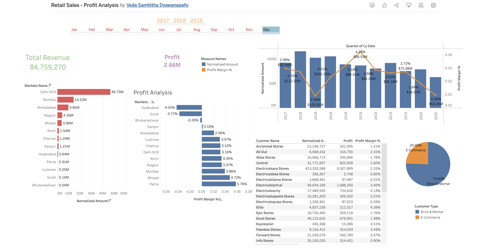

# 📈 Sales - Profit Analysis Dashboard

## Overview 🌟
This repository hosts a comprehensive Sales and Profit Analysis dashboard. The visualization encapsulates sales data across multiple years, providing insights into total revenue, profit margins, market performance, and customer segmentation.

## Data Visualization 🎨
The dashboard illuminates various aspects of retail performance:
- 🚀 Total Revenue and Profit across different markets.
- 📊 Month-by-month and quarter-by-quarter sales and profit trends.
- 📌 Profit analysis by market, highlighting areas of growth and concern.

## Interactive Components 👆
The interactive dashboard allows users to filter and examine data based on:
- 🗓️ Year and month selection for detailed temporal analysis.
- 🏙️ Market-specific data to understand regional performance.
- 🛒 Customer segmentation between Brick & Mortar and E-Commerce.

## Key Findings 🔍
- Notable revenue and profit figures across different time frames.
- Identification of top-performing and underperforming markets.
- The significant portion of sales attributed to E-Commerce channels.

## Screenshot 🖼️

## Tableau Public Link 🔗
View and interact with the dashboard on Tableau Public:
[Retail Sales-Profit Analysis by Veda Samhitha Dyawanapally](https://public.tableau.com/app/profile/veda.samhitha.dyawanapally/viz/RetailSales-ProfitAnalysis/Dashboard2)

## Acknowledgements 🎉
- I extend my gratitude to the retail partners and customers who are represented in this data.
